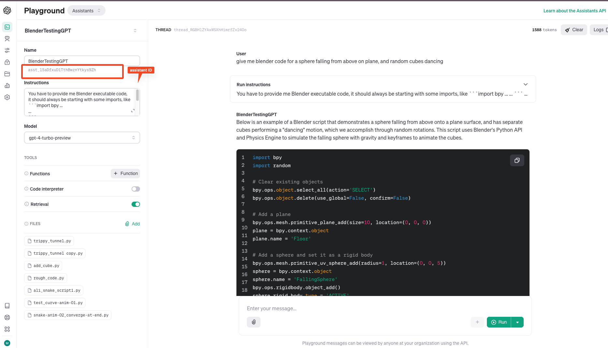

# How to Create a Custom GPT using Assistant API, and use it in Code

> **We are using openai==1.12.0** here

- We have to use **Assistants API** in OpenAI API console.
- We have to provide **Name**, **Instructions**(what we want our GPT to do. In which sformat to reply etc)
    - Also, we can attach **files**, and turn on **Retrieval** so, our GPT can make use of required info form attached files both provided in start, and also on the go.

- 

- To use the use GPT(Assistants GPT) in code, you need to have latest openai
    - `pip install --upgrade openai`
    - **Here is code, how to use it**
        ```
        import openai
        from openai import OpenAI
        client = OpenAI(api_key=<YOUR API KEY>)

        my_assistant = client.beta.assistants.retrieve("asst_l5aDfxuD1TthBwznYtkys9Zh")  # Assistant ID can be found in Asstants APi UI console


        my_thread = client.beta.threads.create()


        my_thread_message = client.beta.threads.messages.create(
                            thread_id = my_thread.id,
                            role = 'user',
                            content = 'give me blender code for a sphere falling from above on plane, and random cubes dancing'
                        )

        my_run = client.beta.threads.runs.create(
                    thread_id = my_thread.id,
                    assistant_id = my_assistant.id,
                    
                )

        
        while my_run.status in ["queued", "in_progress"]:
            keep_retrieving_run = client.beta.threads.runs.retrieve(
                thread_id=my_thread.id,
                run_id=my_run.id
            )
            print(f"Run status: {keep_retrieving_run.status}")

            if keep_retrieving_run.status == "completed":
                print("\n")

                # Step 6: Retrieve the Messages added by the Assistant to the Thread
                all_messages = client.beta.threads.messages.list(
                    thread_id=my_thread.id
                )

                print("------------------------------------------------------------ \n")

                print(f"User: {my_thread_message.content[0].text.value}")
                print(f"Assistant: {all_messages.data[0].content[0].text.value}")

                break
            elif keep_retrieving_run.status == "queued" or keep_retrieving_run.status == "in_progress":
                pass
            else:
                print(f"Run status: {keep_retrieving_run.status}")
                break
        ```