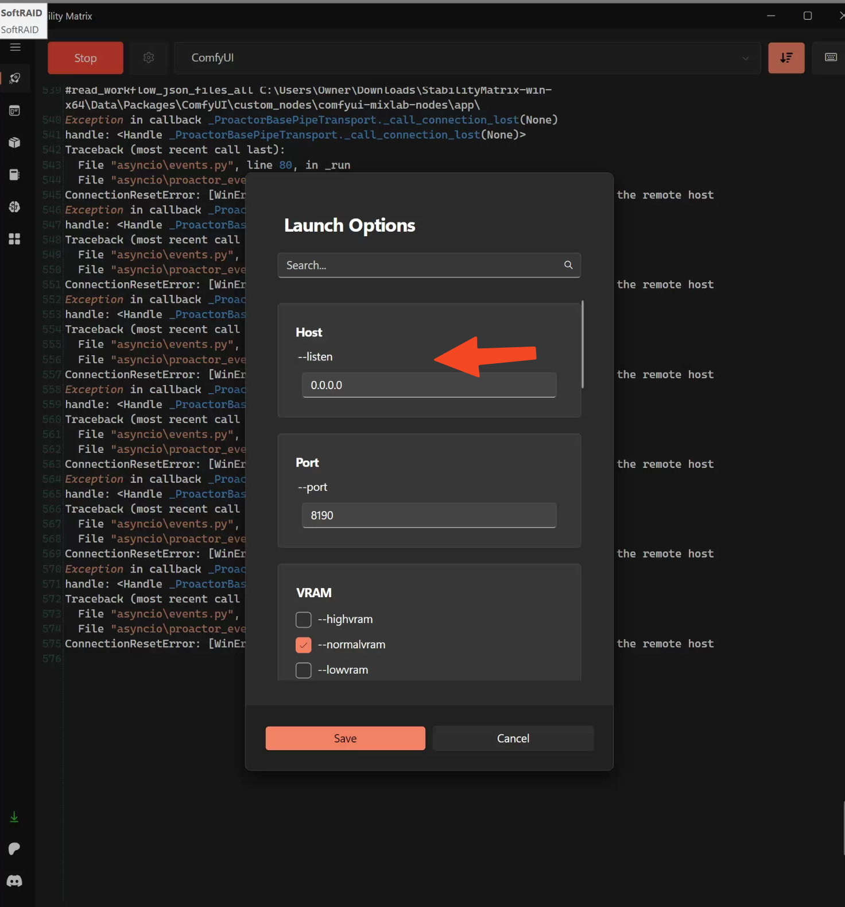

 Launching apps to allow access of all connections to that port 

    ----------------------
    in **host** --listen param :
        put :  `0.0.0.0` instead of `127.0.0.1`

        - this will allow it to listen on all interfaces, and you will be able to access site on following address:
            `https://192.168.0.201:8191/`

            Both in MWPC1 and MWPC2

